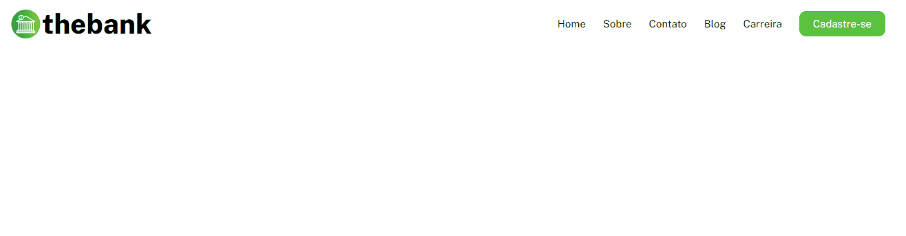

<h1 align="center">
    
    <p>MenuBank</p>
</h1>

<h1>

</h1>

<h3 align="center">
    <a href="https://danilo-de-carvalho88.github.io/menu-bank/">Acessar a demonstração</a>
</h3>

# Índice

- [Sobre](#-sobre)
- [Tecnologias utilizadas](#-tecnologias-utilizadas)
- [Como baixar o projeto](#-como-baixar-o-projeto)
---
## 📝Sobre

O projeto **MenuBank** foi criado para demonstrar uma simples criação de menu para página web tendo a utilização do **FlexBox do CSS** como principal ferramenta para posicionamento dos elementos.

---
## 💻 Tecnologias utilizadas

O projeto foi desenvolvido utilizando as seguintes tecnologias:

- HTML
- CSS (FexBox)

---

## 💽 Como baixar o projeto

1 - Clonar o repositório.

```bash
    $ git clone https://danilo-de-carvalho88.github.io/menu-bank/
```

2 - Entrar no diretório.

```bash
    $ cd menu-bank 
```

3 - Instalar as dependências.

```bash
    $ yarn install 
```

4 - Iniciar o projeto.

```bash
    $ yarn star
```

Desenvolvido por Danilo de Carvalho 😎


